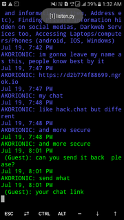
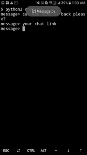

# Scrap Chat

[](https://travis-ci.com/StrinTH/ScrapChat) 
[](https://app.fossa.com/projects/git%2Bgithub.com%2FStrinTH%2FScrapChat?ref=badge_shield)
[](https://saythanks.io/to/0x0is1off@gmail.com)

### A reliable anonymous chat app through termux app

#### NOTE:

```sh
This chat is visible to public at some website but no cookie is being used so no one has any permission to do with the chat.
```

### ***Sample Preview***
 

# Installation

## Termux:

```sh

$ git clone -b termux https://github.com/StrinTH/ScrapChat
$ cd ScrapChat
$ pip install -r requirements.txt
$ python3 listen.py
# open another session and
$ python3 chat.py
```

### **Support authors**:

[](https://www.buymeacoffee.com/6dciIwk)

[](https://paypal.me/0x0is1?locale.x=en_GB)


## Contributing

Please read [CONTRIBUTING.md](CONTRIBUTING.md) for details on our [code of conduct](CODE_OF_CONDUCT.md) and the process of submitting pull requests to us.

## License 
[](https://github.com/StrinTH/ScrapChat/blob/master/LICENSE)

This project is licensed under the MIT License - see the [LICENSE](LICENSE) file for details

[](https://app.fossa.io/projects/git%2Bgithub.com%2FStrinTH%2FScrapChat?ref=badge_large)

<a href="NOTICE.md">Notice</a>
